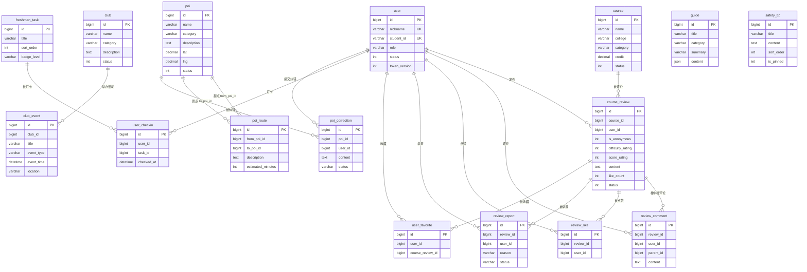

# 数据库设计文档

> 项目：大学萌新领航站（东北大学软件学院 · 校园新生服务平台）
> 数据库：MySQL 8.0　字符集：utf8mb4（utf8mb4_unicode_ci）　存储引擎：InnoDB
> 权威建库脚本：`backend/init.sql`（本文档所有表结构、索引、种子数据均与之一一对应）

---

## 1. 概述

### 1.1 设计目标

本系统面向东北大学（浑南校区）软件学院新生，围绕「选课评价、GPA 计算、社团导航、校园导览、办事攻略、新生任务打卡、安全防线、管理后台」八大功能组织数据。核心业务关系为：

- **用户 → 课程评价**：新生查看老生对课程的经验评价（难度/给分/正文），点赞、评论、收藏、举报；
- **社团 → 活动**：社团信息 + 招新活动时间线（招新日历）；
- **地标（POI）→ 路径/纠错**：浑南校区地标、楼宇间路径指引、用户纠错提交；
- **攻略/任务/安全**：办事流程步骤（JSON）、12 项新生任务打卡、安全防线提示。

### 1.2 基本约定

| 项目 | 约定 |
|------|------|
| 数据库 | `campus_nav`，由 init.sql 首行 `CREATE DATABASE` 创建 |
| 字符集 | `utf8mb4` / `utf8mb4_unicode_ci`（支持中文与 emoji，避免中文乱码） |
| 存储引擎 | InnoDB（全部 16 张表） |
| 主键 | 全部使用 `BIGINT AUTO_INCREMENT`（与 SQLAlchemy `BigInteger` 模型一致） |
| 逻辑删除 | `status` 字段：`1` 正常、`0` 下架/禁用（软删除），涉及 `user`、`course`、`course_review`、`club`、`poi` |
| 审核状态 | `status` VARCHAR：`pending`（待处理）/ `resolved`（已处理）/ `dismissed`（已驳回，仅 review_report 模型注释，落库取值由管理接口控制） |
| 表总数 | 16 张 |
| 时间字段 | `DATETIME`，默认 `CURRENT_TIMESTAMP`；`user.updated_at` 带 `ON UPDATE CURRENT_TIMESTAMP` |

### 1.3 建库方式

- **唯一建库脚本**：`backend/init.sql` 包含「建库 → 16 张表 → 种子数据」，一次执行即可获得可直接演示的完整数据。
- **应用启动兜底**：`backend/app/main.py` 启动时执行 `Base.metadata.create_all(bind=engine)`，若数据库已存在且表缺失则自动补建（不覆盖已有表）。**生产环境建议以 init.sql 为准，迁移使用 Alembic**（依赖中已包含 `alembic==1.13.3`）。
- **注意**：init.sql 中未声明 `FOREIGN KEY` 物理外键约束（避免级联误删），表间引用关系由应用层校验；SQLAlchemy ORM 模型声明了 `ForeignKey`，仅在 `create_all` 兜底建表时产生外键约束。两种方式表结构完全兼容。

### 1.4 种子数据总览

| 表 | 种子行数 | 说明 |
|----|---------|------|
| user | 1 | 管理员 `admin`（bcrypt 哈希，明文密码 `admin123`），角色 ADMIN |
| course | 25 | 依据《软件学院本科生各专业培养方案》（软件工程/信息安全/数字媒体技术方向） |
| course_review | 10 | 模拟老生经验，`created_at` 用 `NOW() - INTERVAL n DAY` 错开时间 |
| club | 15 | 8 个社团 + 7 个学院级学生组织 |
| club_event | 19 | 招新活动时间线，`event_time` 用 `DATE_ADD(NOW(), INTERVAL n DAY)` 相对时间 |
| poi | 14 | 浑南校区实际建筑/设施（教学楼、食堂、宿舍、运动场馆、景观、校门等） |
| poi_route | 8 | 宿舍→教学楼/食堂/图书馆等热门路线 |
| guide | 5 | 报到注册、图书馆借阅、选课操作、校医院就诊 4 篇办事流程 + 选课等学习攻略 |
| freshman_task | 12 | 新生成长任务清单，含 badge_level 勋章等级 |
| safety_tip | 5 | 防诈骗、宿舍安全、紧急电话、冬季安全、实验室安全 |

---

## 2. ER 图



**关系说明**（均为逻辑外键，1 : N）：

| 关系 | 说明 |
|------|------|
| user 1:N course_review / review_comment / review_like / review_report / user_favorite / user_checkin / poi_correction | 用户发布的评价、评论、点赞、举报、收藏、打卡、纠错 |
| course 1:N course_review | 一门课可有多条评价 |
| course_review 1:N review_comment / review_like / review_report | 一条评价的楼中楼评论、点赞记录、举报记录；user_favorite 收藏的是「评价」而非课程 |
| club 1:N club_event | 社团的近期活动（招新日历数据来源） |
| poi 1:N poi_route（两条引用） | `poi_route` 同时引用起点 POI（from_poi_id）与终点 POI（to_poi_id） |
| poi 1:N poi_correction | 用户对地标信息的纠错 |
| freshman_task 1:N user_checkin | 任务模板与用户打卡记录（uk_user_task 保证一人一任务只打一次卡） |
| guide / safety_tip | 独立内容表，无外键关系 |

---

## 3. 表结构详情

> 以下字段表格与 `backend/init.sql` 完全一致（类型、默认值、注释均照抄脚本）。

### 3.1 user — 用户表

| 字段 | 类型 | 约束 | 说明 |
|------|------|------|------|
| id | BIGINT | PK，AUTO_INCREMENT | 用户 ID |
| nickname | VARCHAR(50) | NOT NULL，UNIQUE `uk_nickname` | 昵称（登录账号） |
| student_id | VARCHAR(20) | NULL，UNIQUE `uk_student_id` | 学号（可选） |
| password_hash | VARCHAR(255) | NOT NULL | BCrypt 密码哈希 |
| college | VARCHAR(100) | NULL | 学院 |
| major | VARCHAR(100) | NULL | 专业 |
| grade | VARCHAR(20) | NULL | 入学年份 |
| avatar_url | VARCHAR(500) | NULL | 头像 URL |
| role | VARCHAR(20) | NOT NULL，DEFAULT 'USER' | 角色：USER / ADMIN |
| status | INT | NOT NULL，DEFAULT 1 | 1 正常 / 0 禁用 |
| token_version | INT | NOT NULL，DEFAULT 0 | token 版本号，刷新时 +1，旧 token 失效 |
| created_at | DATETIME | NOT NULL，DEFAULT CURRENT_TIMESTAMP | 创建时间 |
| updated_at | DATETIME | NOT NULL，DEFAULT CURRENT_TIMESTAMP ON UPDATE CURRENT_TIMESTAMP | 更新时间 |

**索引**：`PRIMARY KEY (id)`、`UNIQUE KEY uk_nickname (nickname)`、`UNIQUE KEY uk_student_id (student_id)`

> 注意：`user` 是 MySQL 保留字，SQL 中需使用反引号（init.sql 已处理）。

### 3.2 course — 课程基础表

| 字段 | 类型 | 约束 | 说明 |
|------|------|------|------|
| id | BIGINT | PK，AUTO_INCREMENT | 课程 ID |
| name | VARCHAR(200) | NOT NULL | 课程名称 |
| teacher | VARCHAR(100) | NULL | 授课教师 |
| college | VARCHAR(100) | NULL | 开课学院 |
| category | VARCHAR(50) | NULL | 课程类别（通识必修/通识选修/专业必修/专业选修） |
| credit | DECIMAL(4,2) | NULL | 学分 |
| status | INT | NOT NULL，DEFAULT 1 | 1 正常 / 0 下架（软删除） |
| created_at | DATETIME | NOT NULL，DEFAULT CURRENT_TIMESTAMP | 创建时间 |

**索引**：`PRIMARY KEY (id)`、`INDEX idx_course_college (college)`、`INDEX idx_course_category (category)`

### 3.3 course_review — 课程评价表

| 字段 | 类型 | 约束 | 说明 |
|------|------|------|------|
| id | BIGINT | PK，AUTO_INCREMENT | 评价 ID |
| course_id | BIGINT | NOT NULL | 被评价课程 ID（逻辑外键 → course.id） |
| user_id | BIGINT | NOT NULL | 发布者 ID（逻辑外键 → user.id；匿名评价也存储，仅 API 不返回） |
| is_anonymous | INT | NOT NULL，DEFAULT 0 | 0 实名 / 1 匿名 |
| difficulty_rating | INT | NOT NULL | 难度评分 1-5 |
| score_rating | INT | NOT NULL | 给分评分 1-5 |
| content | TEXT | NOT NULL | 评价正文（10-5000 字） |
| like_count | INT | NOT NULL，DEFAULT 0 | 点赞数（冗余计数，原子 UPDATE 维护） |
| status | INT | NOT NULL，DEFAULT 1 | 1 正常 / 0 被下架（举报处理 remove_review 时置 0） |
| created_at | DATETIME | NOT NULL，DEFAULT CURRENT_TIMESTAMP | 创建时间 |

**索引**：`PRIMARY KEY (id)`、`INDEX idx_review_course_id (course_id)`、`INDEX idx_review_user_id (user_id)`、`INDEX idx_review_created_at (created_at)`、`INDEX idx_review_hot (status, like_count, id)`（热门评价排序专用）

### 3.4 review_comment — 评价评论表

| 字段 | 类型 | 约束 | 说明 |
|------|------|------|------|
| id | BIGINT | PK，AUTO_INCREMENT | 评论 ID |
| review_id | BIGINT | NOT NULL | 所属评价 ID |
| user_id | BIGINT | NOT NULL | 评论者 ID |
| parent_id | BIGINT | NULL | 回复的评论 ID，NULL 为一级评论（最多两级楼中楼） |
| content | TEXT | NOT NULL | 评论内容（1-2000 字） |
| created_at | DATETIME | NOT NULL，DEFAULT CURRENT_TIMESTAMP | 创建时间 |

**索引**：`PRIMARY KEY (id)`、`INDEX idx_comment_review_id (review_id)`、`INDEX idx_comment_parent_id (parent_id)`（查询楼中楼回复）

### 3.5 review_like — 点赞记录表

| 字段 | 类型 | 约束 | 说明 |
|------|------|------|------|
| id | BIGINT | PK，AUTO_INCREMENT | 记录 ID |
| review_id | BIGINT | NOT NULL | 被点赞评价 ID |
| user_id | BIGINT | NOT NULL | 点赞用户 ID |
| created_at | DATETIME | NOT NULL，DEFAULT CURRENT_TIMESTAMP | 点赞时间 |

**索引**：`PRIMARY KEY (id)`、`UNIQUE KEY uk_review_user (review_id, user_id)`（一人一评只能赞一次，防并发重复）、`INDEX idx_like_user_id (user_id)`

### 3.6 review_report — 举报记录表

| 字段 | 类型 | 约束 | 说明 |
|------|------|------|------|
| id | BIGINT | PK，AUTO_INCREMENT | 举报 ID |
| review_id | BIGINT | NOT NULL | 被举报评价 ID |
| user_id | BIGINT | NOT NULL | 举报人 ID |
| reason | VARCHAR(500) | NOT NULL | 举报原因（5-500 字） |
| status | VARCHAR(20) | NOT NULL，DEFAULT 'pending' | pending 待处理 / resolved 已处理 |
| created_at | DATETIME | NOT NULL，DEFAULT CURRENT_TIMESTAMP | 举报时间 |

**索引**：`PRIMARY KEY (id)`、`INDEX idx_report_status (status)`

### 3.7 user_favorite — 用户收藏表

| 字段 | 类型 | 约束 | 说明 |
|------|------|------|------|
| id | BIGINT | PK，AUTO_INCREMENT | 收藏 ID |
| user_id | BIGINT | NOT NULL | 收藏用户 ID |
| course_review_id | BIGINT | NOT NULL | 被收藏的评价 ID |
| created_at | DATETIME | NOT NULL，DEFAULT CURRENT_TIMESTAMP | 收藏时间 |

**索引**：`PRIMARY KEY (id)`、`UNIQUE KEY uk_user_review (user_id, course_review_id)`、`INDEX idx_favorite_review_id (course_review_id)`（联合唯一键以 user_id 为前缀，无法服务按评价查收藏数的场景，故单列补此索引）

### 3.8 user_checkin — 用户打卡表

| 字段 | 类型 | 约束 | 说明 |
|------|------|------|------|
| id | BIGINT | PK，AUTO_INCREMENT | 打卡 ID |
| user_id | BIGINT | NOT NULL | 打卡用户 ID |
| task_id | BIGINT | NOT NULL | 任务 ID（逻辑外键 → freshman_task.id） |
| checked_at | DATETIME | NOT NULL，DEFAULT CURRENT_TIMESTAMP | 打卡时间 |

**索引**：`PRIMARY KEY (id)`、`UNIQUE KEY uk_user_task (user_id, task_id)`（一人一任务只打一次卡）、`INDEX idx_checkin_user_id (user_id)`、`INDEX idx_checkin_task_id (task_id)`（管理端删除任务前检查打卡记录）

### 3.9 club — 社团信息表

| 字段 | 类型 | 约束 | 说明 |
|------|------|------|------|
| id | BIGINT | PK，AUTO_INCREMENT | 社团 ID |
| name | VARCHAR(200) | NOT NULL | 社团名称 |
| category | VARCHAR(50) | NOT NULL | 分类：学生组织/学术科技/志愿公益/文体艺术/创新创业/其他（支持逗号拼接多分类，如「学生组织,志愿公益」） |
| logo_url | VARCHAR(500) | NULL | Logo URL |
| description | TEXT | NULL | 社团简介 |
| activity_frequency | VARCHAR(100) | NULL | 活动频率 |
| requirements | TEXT | NULL | 招新要求 |
| tips | TEXT | NULL | 防坑指南 |
| contact | VARCHAR(200) | NULL | 联系方式 |
| status | INT | NOT NULL，DEFAULT 1 | 1 正常 / 0 下架（软删除） |
| created_at | DATETIME | NOT NULL，DEFAULT CURRENT_TIMESTAMP | 创建时间 |

**索引**：`PRIMARY KEY (id)`、`INDEX idx_club_category (category)`

### 3.10 club_event — 社团活动表

| 字段 | 类型 | 约束 | 说明 |
|------|------|------|------|
| id | BIGINT | PK，AUTO_INCREMENT | 活动 ID |
| club_id | BIGINT | NOT NULL | 所属社团 ID |
| title | VARCHAR(200) | NOT NULL | 活动标题 |
| event_type | VARCHAR(50) | NULL | 类型：宣讲会/面试/开放日/其他 |
| event_time | DATETIME | NOT NULL | 活动时间 |
| location | VARCHAR(200) | NULL | 地点 |
| description | TEXT | NULL | 活动描述 |
| created_at | DATETIME | NOT NULL，DEFAULT CURRENT_TIMESTAMP | 创建时间 |

**索引**：`PRIMARY KEY (id)`、`INDEX idx_event_club_id (club_id)`、`INDEX idx_event_time (event_time)`

### 3.11 poi — 校园地标表

| 字段 | 类型 | 约束 | 说明 |
|------|------|------|------|
| id | BIGINT | PK，AUTO_INCREMENT | 地标 ID |
| name | VARCHAR(200) | NOT NULL | 地标名称 |
| category | VARCHAR(50) | NOT NULL | 分类：教学楼/食堂/宿舍/快递点/运动场馆/行政楼/其他 |
| description | TEXT | NULL | 图文描述 |
| photo_url | VARCHAR(500) | NULL | 照片 URL |
| open_hours | VARCHAR(200) | NULL | 开放时间 |
| floor_info | VARCHAR(500) | NULL | 楼层指引 |
| tips | TEXT | NULL | 注意事项 |
| lat | DECIMAL(10,7) | NULL | 纬度（预留） |
| lng | DECIMAL(10,7) | NULL | 经度（预留） |
| status | INT | NOT NULL，DEFAULT 1 | 1 正常 / 0 下架（软删除） |
| created_at | DATETIME | NOT NULL，DEFAULT CURRENT_TIMESTAMP | 创建时间 |

**索引**：`PRIMARY KEY (id)`、`INDEX idx_poi_category (category)`、`INDEX idx_poi_name (name)`（搜索）

### 3.12 poi_route — 路径指引表

| 字段 | 类型 | 约束 | 说明 |
|------|------|------|------|
| id | BIGINT | PK，AUTO_INCREMENT | 路径 ID |
| from_poi_id | BIGINT | NOT NULL | 起点地标 ID |
| to_poi_id | BIGINT | NOT NULL | 终点地标 ID |
| description | TEXT | NOT NULL | 路径文字描述 |
| estimated_minutes | INT | NULL | 预估步行分钟数 |

**索引**：`PRIMARY KEY (id)`、`INDEX idx_route_from_to (from_poi_id, to_poi_id)`

### 3.13 poi_correction — 纠错记录表

| 字段 | 类型 | 约束 | 说明 |
|------|------|------|------|
| id | BIGINT | PK，AUTO_INCREMENT | 纠错 ID |
| poi_id | BIGINT | NOT NULL | 被纠错地标 ID |
| user_id | BIGINT | NOT NULL | 提交用户 ID |
| content | TEXT | NOT NULL | 纠错内容 |
| status | VARCHAR(20) | NOT NULL，DEFAULT 'pending' | pending 待处理 / resolved 已处理 |
| created_at | DATETIME | NOT NULL，DEFAULT CURRENT_TIMESTAMP | 提交时间 |

**索引**：`PRIMARY KEY (id)`、`INDEX idx_correction_status (status)`

### 3.14 guide — 攻略表

| 字段 | 类型 | 约束 | 说明 |
|------|------|------|------|
| id | BIGINT | PK，AUTO_INCREMENT | 攻略 ID |
| title | VARCHAR(200) | NOT NULL | 攻略标题 |
| category | VARCHAR(50) | NOT NULL | 分类：办事流程/生活指南/学习攻略 |
| summary | VARCHAR(500) | NULL | 一句话简介 |
| content | JSON | NULL | 步骤内容（JSON 步骤数组，见 §4.6） |
| created_at | DATETIME | NOT NULL，DEFAULT CURRENT_TIMESTAMP | 创建时间 |

**索引**：`PRIMARY KEY (id)`、`INDEX idx_guide_category (category)`、`INDEX idx_guide_title (title)`（搜索）

### 3.15 freshman_task — 新生任务模板表

| 字段 | 类型 | 约束 | 说明 |
|------|------|------|------|
| id | BIGINT | PK，AUTO_INCREMENT | 任务 ID |
| title | VARCHAR(200) | NOT NULL | 任务标题 |
| description | TEXT | NULL | 任务说明 |
| icon | VARCHAR(50) | NULL | Element Plus 图标名 |
| sort_order | INT | NOT NULL，DEFAULT 0 | 排序（升序展示） |
| badge_level | VARCHAR(20) | NULL | 关联勋章等级（bronze/silver/gold） |
| created_at | DATETIME | NOT NULL，DEFAULT CURRENT_TIMESTAMP | 创建时间 |

**索引**：`PRIMARY KEY (id)`、`INDEX idx_task_sort (sort_order)`

### 3.16 safety_tip — 安全防线表

| 字段 | 类型 | 约束 | 说明 |
|------|------|------|------|
| id | BIGINT | PK，AUTO_INCREMENT | 提示 ID |
| title | VARCHAR(200) | NOT NULL | 标题 |
| content | TEXT | NOT NULL | 正文（含换行符） |
| image_url | VARCHAR(500) | NULL | 配图 URL |
| sort_order | INT | NOT NULL，DEFAULT 0 | 排序 |
| is_pinned | INT | NOT NULL，DEFAULT 0 | 是否置顶（1 置顶） |
| created_at | DATETIME | NOT NULL，DEFAULT CURRENT_TIMESTAMP | 创建时间 |

**索引**：`PRIMARY KEY (id)`、`INDEX idx_safety_pinned_sort (is_pinned, sort_order)`

---

## 4. 关键设计说明

### 4.1 匿名评价：user_id 仍存储，API 层脱敏

`course_review.user_id` 为 NOT NULL，**匿名评价同样落库**（用于追责、去重、统计）；是否匿名由 `is_anonymous` 控制。`backend/app/services/course_service.py` 的 `_build_review_responses_batch` 中：匿名评价在响应里 `user_id` 置 `null`、`nickname` 显示「匿名用户」，从而不泄露发布者身份。管理后台举报审核列表同样按此规则展示。

### 4.2 like_count 冗余计数 + 原子更新

- `course_review.like_count` 是点赞数的冗余快照，列表排序无需 JOIN 计数；
- 点赞/取消点赞通过 SQLAlchemy 原子 `UPDATE ... SET like_count = like_count ± 1` 维护（取消点赞时带 `WHERE like_count > 0` 下限保护），避免「读-改-写」并发竞态；
- `review_like` 的联合唯一键 `uk_review_user` 兜底并发重复点赞（IntegrityError → 400「请勿重复点赞」）；
- `idx_review_hot (status, like_count, id)` 复合索引专为「热门评价」排序（首页热门榜取点赞最多 3 条）设计。

### 4.3 status 软删除

`course` / `club` / `poi` / `course_review` 均以 `status = 0` 实现软删除（管理端「删除」接口只是置 0）：

- 列表/详情查询统一过滤 `status == 1`，已下架资源对外表现为 404；
- 关联记录不物理删除：如 POI 软删除后，`poi_correction` 仍 JOIN 出 `poi_name` 供管理员查看（`poi_service.get_corrections`）；评价被举报下架后收藏列表自动过滤（`get_my_favorites` 与 total 口径一致）；
- `guide` / `freshman_task` 无子表或需清理（任务有打卡记录时管理端拒绝删除），采用硬删除。

### 4.4 token_version：refresh token 轮换撤销

- JWT payload 携带 `ver`（= `user.token_version`）；
- `POST /api/user/refresh` 刷新成功后 `token_version +1` 并签发新 token 对，旧 refresh_token 因版本不匹配立即作废；
- 收到版本不匹配的 token（疑似复用/被盗）时直接 401 并记录警告日志（`user_service.refresh_access_token`）；
- 管理员禁用用户后，鉴权依赖每请求回查 DB（`middleware/auth.py` 的 `get_current_user`），该用户所有已签发 token 立即失效。

### 4.5 club_event 相对时间种子

种子数据的 `event_time` 全部使用 `DATE_ADD(NOW(), INTERVAL n DAY)`（n = 2~55 天），保证**任何时候初始化数据库，招新日历都不会因活动过期而被 `event_time >= NOW()` 过滤为空**；同时配套 `idx_event_time` 索引支持按时间排序过滤。

### 4.6 guide.content JSON 步骤数组

攻略正文 `content` 为 MySQL JSON 类型，值为步骤数组，每项结构：

```json
[{"step": 1, "title": "抵达浑南校区", "description": "...", "location_poi_id": 12}]
```

- `step`：步骤序号（数字或字符串）；`title`：步骤标题；`description`：步骤说明；`location_poi_id`：关联地标 ID（可空，前端用于跳转导览）；
- 管理端 `GuideUpsert` 的 `field_validator` 强制校验每一项必须包含 `step/title/description`，否则 422。

### 4.7 其他约定

- **多分类社团**：`club.category` 支持逗号拼接（如「学生组织,志愿公益」），社团列表分类筛选使用 `LIKE '%分类%'` 匹配任一分类命中；
- **勋章等级**：任务打卡响应中的勋章由完成数动态计算（3 铜 / 5 银 / 10 金 / 全部钻石），`freshman_task.badge_level` 是任务模板上标注的建议等级，两者独立；
- **昵称即账号**：`user.nickname` 唯一，是登录凭证；`student_id` 可选且唯一；
- **密码**：BCrypt 哈希存储（passlib），明文上限 72 字节（bcrypt 截断限制）。

---

## 5. 附录：数据字典汇总

| 表名 | 中文名 | 主键 | 关键唯一约束 | 种子行数 | 主要关联 |
|------|--------|------|--------------|---------|----------|
| user | 用户表 | id | uk_nickname, uk_student_id | 1 | → course_review / review_like / user_favorite / user_checkin / poi_correction |
| course | 课程基础表 | id | — | 25 | → course_review |
| course_review | 课程评价表 | id | — | 10 | ← course, user；→ review_comment / review_like / review_report / user_favorite |
| review_comment | 评价评论表 | id | — | 0 | ← course_review, user（parent_id 自引用，两级楼中楼） |
| review_like | 点赞记录表 | id | uk_review_user | 0 | ← course_review, user |
| review_report | 举报记录表 | id | — | 0 | ← course_review, user |
| user_favorite | 用户收藏表 | id | uk_user_review | 0 | ← user, course_review |
| user_checkin | 用户打卡表 | id | uk_user_task | 0 | ← user, freshman_task |
| club | 社团信息表 | id | — | 15 | → club_event |
| club_event | 社团活动表 | id | — | 19 | ← club |
| poi | 校园地标表 | id | — | 14 | → poi_route（起/终点）、poi_correction |
| poi_route | 路径指引表 | id | — | 8 | ← poi ×2 |
| poi_correction | 纠错记录表 | id | — | 0 | ← poi, user |
| guide | 攻略表 | id | — | 5 | 独立 |
| freshman_task | 新生任务模板表 | id | — | 12 | → user_checkin |
| safety_tip | 安全防线表 | id | — | 5 | 独立 |

**枚举值速查**：

| 字段 | 取值 |
|------|------|
| user.role | `USER` / `ADMIN` |
| user.status / course.status / course_review.status / club.status / poi.status | `1` 正常，`0` 禁用/下架 |
| course_review.is_anonymous / safety_tip.is_pinned | `0` / `1` |
| review_report.status / poi_correction.status | `pending` / `resolved` |
| freshman_task.badge_level | `bronze` / `silver` / `gold`（+ 运行时计算的 `diamond`） |
| course.category（种子取值） | 通识必修 / 通识选修 / 专业必修 / 专业选修 |
| club.category | 学生组织 / 学术科技 / 志愿公益 / 文体艺术 / 创新创业 / 其他（可逗号多选） |
| poi.category | 教学楼 / 食堂 / 宿舍 / 快递点 / 运动场馆 / 行政楼 / 其他 |
| guide.category | 办事流程 / 生活指南 / 学习攻略 |
